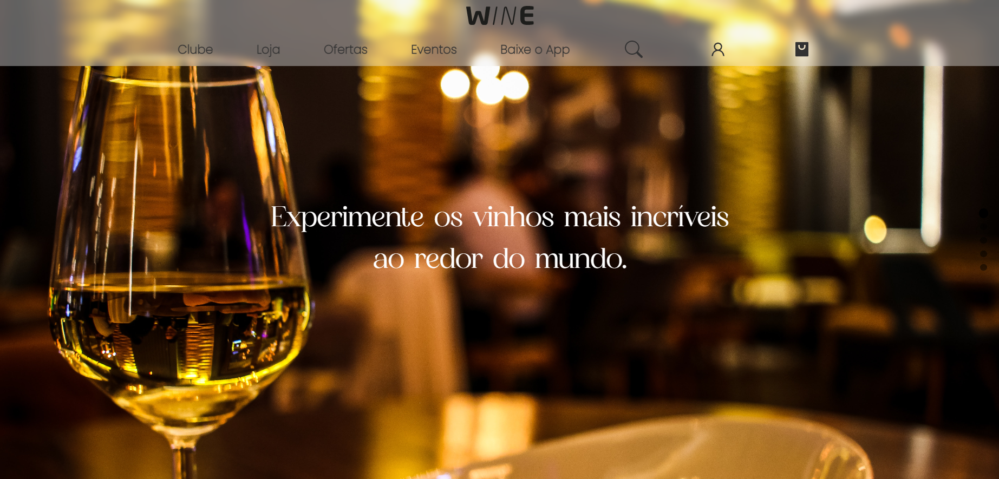
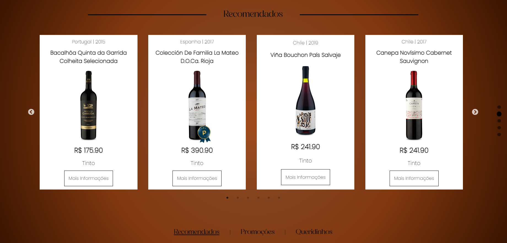

# Instruções para rodar o projeto localmente

1. Faça um clone do projeto: `git clone git@github.com:JoaumVictor/wine-landing-page.git`

2. Instale as dependências: `npm install`

1. Inicie o projeto: `npm start`

## Wine Landing Page

A ideia desse projeto é criar a landing page de um e-commerce de vinhos!

